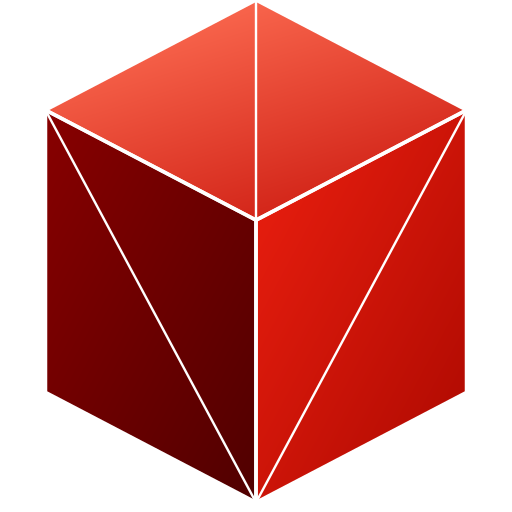

<p align="center">
  
</p>

# NU - Not Unity

> "Your project isn't bad,
> You are just looking at it wrong."

Discovered after writing an entire engine
with the Y axis flipped, and nearly lost mind.

*Seriously though, if anything is still flipped, tell me.*

Forget the GPU driver exists.
Powered by Vulkan.

Rust Vulkan renderer/runtime in progress, built with [ash](https://crates.io/crates/ash).

## License

NU Engine currently uses a custom staged source-available license:

- Pre-1.0.0: source-visible and contribution-friendly, but not licensed for shipping Products
- 1.0.0+: free for personal, open source, and commercial Products below $1M lifetime gross revenue
- Above $1M: 5% of gross revenue above the threshold
- Includes an explicit non-retroactive "Anti-Unity" trust guarantee for shipped Products

See [LICENSE](LICENSE).

## Current state


*Genuinely flipped right now, do not worry, the editor is not flipped*

- `app`: reusable `winit` application runner and window configuration layer.
- `core`: config, error types, context builder and handle slots.
- `graphics`: lightweight projection helpers for pseudo-3D graphics rendered through the 2D backend.
- `scene`: scene trait, `Camera2D`, `Camera3D`, `Canvas2D`, `DrawSpace`, built-in 2D primitive draw commands, and a minimal real 3D cube primitive (`CubeDraw3D`).
- `runtime`: Vulkan runtime that owns the window/render loop/backend and consumes scene draw commands.
- `renderer`: frame lifecycle, 2D sprite queue, 3D mesh queue.
- `resource`: buffer/image registry handles and descriptors.
- `pipeline`: descriptor/material/pipeline template library.
- `HighPowerVulkanApi`: top-level object wiring all modules together.
- `demo::run_square_demo()`: thin scene example that asks `nu` to draw a red square.
- `demo::run_spinning_block_demo()`: thin scene example that asks `nu` to draw a depth-tested rotating red cube.
- Built-in 3D primitives: `Cube`, `Plane`, `Sphere`.
- Scene format supports imported OBJ mesh references through `.nuscene` `geometry = obj` plus `source = ...`.

## Roadmap

- Vulkan.org listing track and near-term milestones: `ROADMAP.md`

## Run the demos

```bash
cargo run --example square_demo
cargo run --example spinning_block_demo
```

Notes:
- The runtime compiles `shaders/primitive_2d.vert` and `shaders/primitive_2d.frag` to SPIR-V via `build.rs`.
- Window resize now recreates swapchain-dependent resources automatically.
- Scenes now use `Scene`, `SceneFrame`, `Camera2D`, and built-in 2D draw commands while `nu` owns windowing, Vulkan setup, and frame submission.
- `SceneFrame::canvas()` exposes higher-level 2D helpers so scenes can request filled/stroked shapes without constructing draw structs manually.
- `SceneFrame::ui_canvas()` exposes a screen-space overlay path for HUD/UI primitives in pixel coordinates, independent of the world camera.
- Rectangles and circles support filled and stroked styles; lines support thickness, layering, alpha blending, and anti-aliased edges.
- The runtime batches 2D primitives into a per-frame instance buffer and renders them with a single instanced draw call.
- The runtime now includes a minimal real 3D path: a dedicated depth attachment, a separate 3D pipeline, and `CubeDraw3D` rendered as depth-tested triangles before the 2D pass.
- The render pass now uses basic MSAA for smoother 2D and 3D edges, resolving the multisampled color target into the swapchain each frame.
