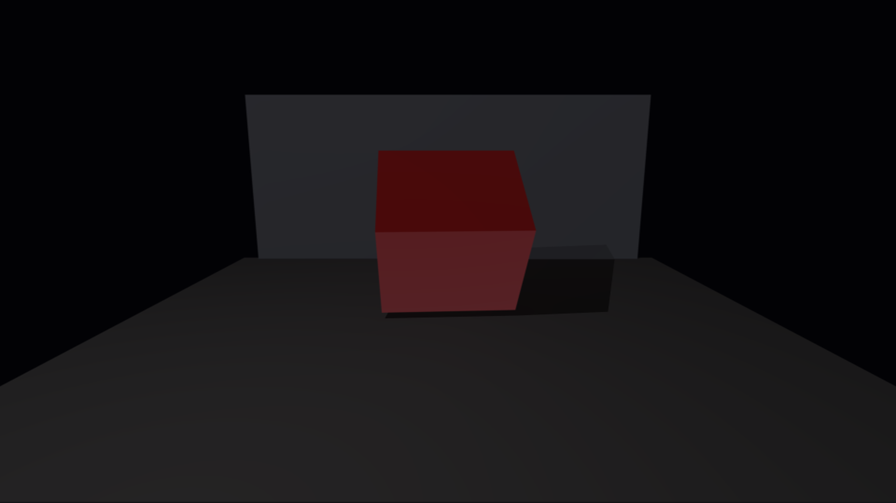
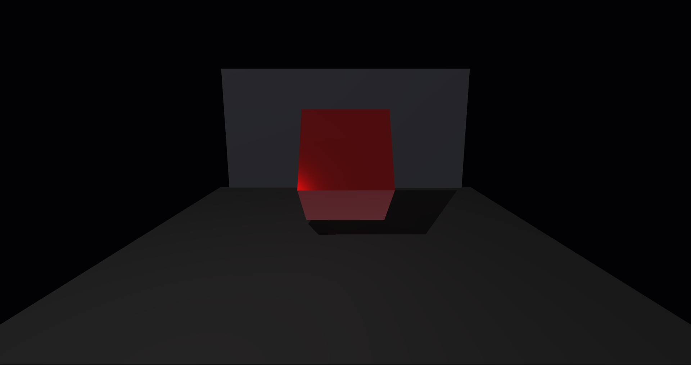

<p align="center">
  
</p>

# NU - Not Unity

> "Your project isn't bad,
> You are just looking at it wrong."

Discovered after writing an entire engine
with the Y axis flipped, and nearly lost mind.

*Seriously though, if anything is still flipped, tell me.*

Forget the GPU driver exists.
Powered by Vulkan.

Rust Vulkan renderer/runtime in progress, built with [ash](https://crates.io/crates/ash).

Not to be confused with [Nu By bryanedds](https://github.com/bryanedds/Nu).

---

## Screenshots

<p align="center">
  
  
</p>

*Spinning block demo: PBR lighting, PCF soft shadows, point light with emissive glow — all running on the Vulkan backend.*

---

## License

NU Engine currently uses a custom staged source-available license:

- Pre-1.0.0: source-visible and contribution-friendly, but not licensed for shipping Products
- 1.0.0+: free for personal, open source, and commercial Products below $1M lifetime gross revenue
- Above $1M: 5% of gross revenue above the threshold
- Includes an explicit non-retroactive "Anti-Unity" trust guarantee for shipped Products

See [LICENSE](LICENSE).

---

## Current state

### Rendering

- **PBR shading** — GGX NDF, Smith geometry term, Fresnel-Schlick BRDF. Roughness and metallic per material.
- **ACES tonemapping** with linear → sRGB conversion on the final blit.
- **HDR render targets** — `RGBA16F` color attachment for full-range HDR scene accumulation.
- **PCF soft shadows** — Vogel-disk kernel over a directional shadow map, configurable filter radius and bias.
- **Normal mapping** — tangent-space normals via per-vertex TBN matrix; enabled per draw call when a normal texture is bound.
- **Emissive materials** — per-material emissive intensity bypasses lighting and fog, contributing directly to the HDR buffer.
- **Object-based ambient occlusion** — SSBO cube ray-intersection pass darkens surfaces near geometry.
- **Atmospheric fog** — exponential distance-based fog blended before tonemap; clamped to avoid crushing emissive surfaces.
- **MSAA** — multisampled color resolve into the swapchain each frame.

### Lighting

- **Point lights** — up to 4, with per-light range attenuation and optional shadow casting.
- **Spotlights** — up to 4, with inner/outer cone angles, smooth penumbra blend, and squared cosine falloff.
- **Directional fill light** — cool-toned back fill for ambient directionality.
- **Configurable shadows** — `ShadowMode::Off` or `ShadowMode::Live`; shadow minimum visibility, bias, and PCF filter radius all exposed on `ShadowConfig`.

### Scene & Primitives

- **Built-in 3D primitives** — `Cube`, `Plane`, `Sphere`, plus procedural:
  - `Mesh3D::cylinder()` — side quads with top/bottom disk caps
  - `Mesh3D::torus()` — major/minor segment parameterised ring
  - `Mesh3D::cone()` — tapering sides with base cap
  - `Mesh3D::capsule()` — hemisphere caps + cylinder body
  - `Mesh3D::icosphere()` — icosahedron with iterative midpoint subdivision
- All procedural meshes include full UV and tangent data for normal mapping.
- **Custom mesh import** — OBJ assets via `Mesh3D::Custom(Arc<MeshAsset3D>)` or `.nuscene` `geometry = obj`.

### Sculpting

- **CPU sculpting system** (`SculptMesh`) — deform any mesh at runtime with configurable brushes.
- **Brush modes** — `Inflate`, `Deflate`, `Push`, `Pull`, `Smooth`, `Flatten`, `Pinch`.
- **Falloff curves** — `Linear`, `Smooth`, `Constant`, `Sphere`.
- **X-axis symmetry** — optional mirror pass for symmetric sculpts.
- Sculpted meshes round-trip back to `Arc<MeshAsset3D>` for GPU upload via `Mesh3D::Custom`.

### Camera & Culling

- `Camera3D` with `view_matrix()`, `projection_matrix()` (Vulkan Y-down, Z in [0,1]), orbit/dolly/strafe/zoom.
- **Frustum culling** — Gribb-Hartmann plane extraction; sphere and AABB tests against all 6 planes.

### Engine Modules

- `app` — reusable `winit` application runner and window configuration.
- `core` — config, error types, context builder and handle slots.
- `scene` — `Camera2D`, `Camera3D`, `Canvas2D`, `Frustum`, `Mesh3D`, `MeshAsset3D`, `MeshMaterial3D`, `MeshVertex3D`, 2D draw commands.
- `scene::primitives` — procedural mesh generators.
- `scene::sculpt` — `SculptBrush`, `SculptMesh`, brush modes and falloffs.
- `lighting` — `PointLight`, `SpotLight`, `DirectionalLight`, `LightingConfig`, `ShadowConfig`.
- `runtime` — Vulkan runtime: window/render loop, shadow map pass, 3D mesh pass, 2D overlay pass.
- `renderer` — frame lifecycle, 2D sprite queue, 3D mesh queue.
- `physics` — collision detection, rigid bodies, contact resolution.
- `resource` — buffer/image registry handles and descriptors.
- `rhi` — thin Vulkan RHI: buffers, textures (`Rgba8`, `Rgba16Float`, `R8Unorm`, `D32Float`), pipelines.
- `pipeline` — descriptor/material/pipeline template library.
- `engine::world` — ECS-lite `NuSceneWorld` with `EntityId`, `TransformComponent`, `MeshRendererComponent`, `LightComponent`, `PhysicsBodyComponent`.
- `HighPowerVulkanApi` — top-level object wiring all modules together.

---

## Run the demos

```bash
cargo run --example square_demo
cargo run --example spinning_block_demo
cargo run --example physics_demo
```

---

## C++ FFI Scratch Example

- C ABI header: [include/nu_ffi.h](include/nu_ffi.h)
- OpenGL-style C++ wrapper and Minecraft-like block sample:
  - [examples/cpp/nu_gl_scratch.hpp](examples/cpp/nu_gl_scratch.hpp)
  - [examples/cpp/minecraft_block.cpp](examples/cpp/minecraft_block.cpp)
  - [examples/cpp/README.md](examples/cpp/README.md)

---

## Roadmap & Docs

- Vulkan.org listing track and near-term milestones: `ROADMAP.md`
- [docs/ENGINE_ARCHITECTURE.md](docs/ENGINE_ARCHITECTURE.md)
- [docs/COMPONENT_SYSTEMS.md](docs/COMPONENT_SYSTEMS.md)
- [docs/RESOURCE_MANAGEMENT.md](docs/RESOURCE_MANAGEMENT.md)
- [docs/RENDERING_PIPELINE.md](docs/RENDERING_PIPELINE.md)
- [docs/EVENT_SYSTEMS.md](docs/EVENT_SYSTEMS.md)
- [docs/API_MAP.md](docs/API_MAP.md)
- [docs/RENDERER_INTERNALS.md](docs/RENDERER_INTERNALS.md)
- [docs/FFI_USAGE.md](docs/FFI_USAGE.md)
- [docs/SPINNING_CUBE_SHOWCASE.md](docs/SPINNING_CUBE_SHOWCASE.md)
- [CONTRIBUTING.md](CONTRIBUTING.md) · [SECURITY.md](SECURITY.md) · [CODE_OF_CONDUCT.md](CODE_OF_CONDUCT.md) · [CHANGELOG.md](CHANGELOG.md)

---

## Notes

- Shaders (`shaders/primitive_2d.vert/.frag`, `shaders/cube_3d.vert/.frag`) are compiled to SPIR-V at build time via `build.rs` using `shaderc`.
- Window resize automatically recreates swapchain-dependent resources.
- `SceneFrame::canvas()` exposes higher-level 2D helpers for filled/stroked shapes without constructing draw structs manually.
- `SceneFrame::ui_canvas()` exposes a screen-space HUD/UI overlay in pixel coordinates, independent of the world camera.
- The runtime batches 2D primitives into a per-frame instance buffer and renders them with a single instanced draw call.
